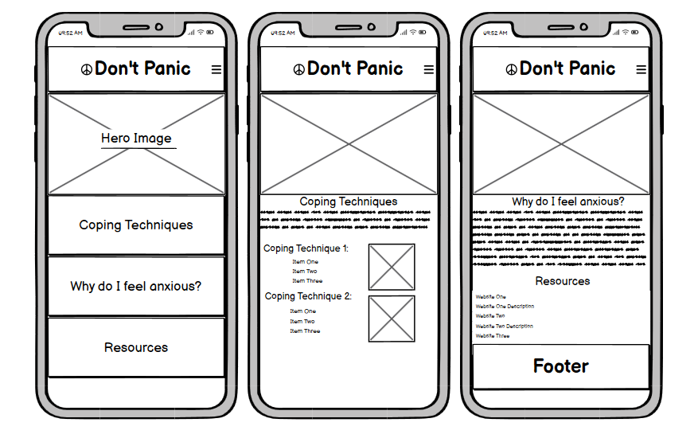
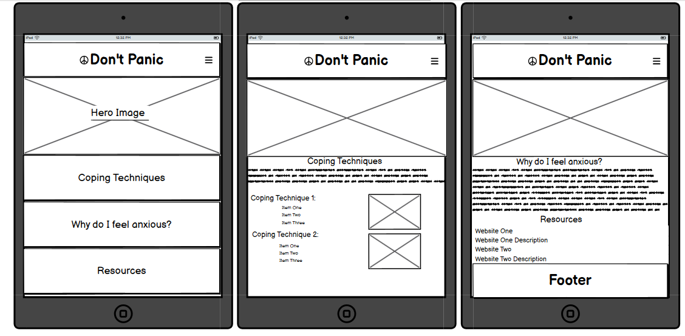
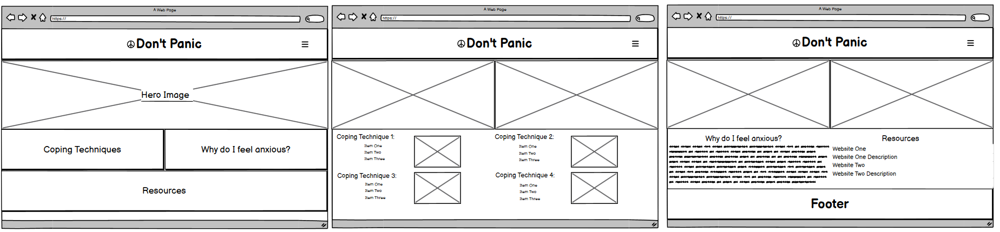

# Don't Panic

Don't Panic is a guide for users who suffer with anxiety or panic disorders. It's primary purpose is to inform the user and provide techniques for dealing with anxiety. Additionally, it provides the user with links to useful resources.

## User Stories

**Must**
- I want to find techniques that can help to reduce mine or a relative's anxiety.

- I want information on anxiety and what causes it.

**Should**
- I want to know where I can access professional help.

**Could**
- I want to connect with others who also suffer with anxiety.

## Accessibility

### Color Scheme

Using a [color palette generator](https://coolors.co/2f200f-826341-d5a572-3f645a-8eb8ac-a7c8bf-dbad6a-dfd5a0), I chose the following colors as they were neutral and contrasted well with each other (checked using a [color contrast checker](https://webaim.org/resources/contrastchecker/))
- #2F200F
- #826341
- #D5A572
- #3F645A
- #8EB8AC
- #A7C8BF
- #DBAD6A
- #DFD5A0

### Fonts

I did research on fonts that were designed to reduce visual stress and improve accessibility for visually impaired users, and decided to use the following font families:
- Atkinson Hyperlegible **(Primary)**
- Arial **(If primary font fails to load)**

## Design Decisions

### Wireframes

#### Mobile Design

#### Tablet Design

#### Desktop Design

## Reflection on Development Process

### Final Thoughts

#### Challenges

I had a lot of difficulty setting up the dropdown menu in the navbar. Unfortunately, I put it aside in the end as I didn't want to run out of time to finish other aspects of the project.

I also struggled to make the project responsive using the bootstrap grid classes.

#### Reflections

I will take more care in the future during the design of my projects to keep my code tidy and ordered. I will also research areas which I showed weakness in during this project.

Overall, I am happy with the structure and content of the project for the mobile viewport. Given more time, I believe I would be able to address any gaps in the project and optimise the website for all viewports.

### References

I used the following websites to assist me throughout this project:

[Coolors](https://coolors.co/)

[W3Schools](https://www.w3schools.com/)

[Bootstrap](https://getbootstrap.com/)